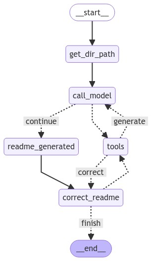

# rdmgen

rdmgen is a Python CLI tool to automatically generate high-quality README.md files for code repositories using Amazon Bedrock and LangGraph.

## Overview 

This project uses the AWS Bedrock, LangGraph, and LangChain AWS libraries to analyze the structure and contents of a code repository and generate a comprehensive README file. The generated README provides an overview of the project, installation instructions, usage examples, and other relevant details based on the files in the repository.

## Workflow


## Features

- **Automated README Generation**: No more manually writing README files! rdmgen does the hard work for you.
- **Local or Remote Repos**: Supports generating READMEs for local repos or public GitHub repositories.
- **Execution Visualization**: Optionally generate a diagram visualizing the LangGraph agent's execution flow.
- **Customizable Output**: Write the generated README to any directory you specify.

## Installation

Please Note: You need `python >= 3.9`. You can check this with `python --version`. If your base environment does not have the required version, create a virtual environment with the required version and use "Option 1" to install. 

### Option 1: Using pip

You can install the package with pip after cloning the repository.

```
pip install .
```

### Option 2: Makefile

A Makefile with some recipes is available for linux/MacOS, to create a dedicated python venv and install `rdmgen` in it. Run:
```
make all
```
The virtual env is named `.venv` by default, and it's located in the same directory as the repository.
Now run the following command to activate the environment:
```
source .venv/bin/activate
```

For more make recipes, run `make help`.

## Usage

### Prerequisites

1. AWS crednetials: before running the cli commands to generate a README, AWS credentials are required. If you are running this from within an AWS environment (e.g. SageMaker Notebook instance), you can proceed to 2 to ensure correct permissions are granted to the attached IAM Role.

2. IAM Permissions: the IAM User or Role should have at least the following permissions on the selected model (replace the resource * with the model(s)):
```json
{
    "Version": "2012-10-17",
    "Statement": [
        {
            "Sid": "VisualEditor0",
            "Effect": "Allow",
            "Action": [
                "bedrock:InvokeModel",
                "bedrock:InvokeModelWithResponseStream"
            ],
            "Resource": "*"
        }
    ]
}
```

3. Model access in Amazon Bedrock: ensure you have access to the selected model.

**Note:** The project uses Claude 3 sonnet: `anthropic.claude-3-sonnet-20240229-v1:0` from Amazon Bedrock. Please make sure you have access to it. If you would like to change the model ID, please update it in the `src/rdmgen/constants.py` and re-install the package.


### Commands
To generate a README for your repository, run the cli command:

```
rdmgen <REPO_PATH> --out <OUTPUT_FOLDER>
```
`REPO_PATH` can be a local clone/directory or a remote Git URL.

You can pass the `--diagram` flag to create the flowchart of the agent to see the steps it ran. 


### Examples

Two examples are availabe in this repository for testing:
```
rdmgen test_data/hello_world
```

```
rdmgen test_data/sensor_extraction --out ./output
```

Example for a small remote repository on GitHub:
```
rdmgen https://github.com/pypa/sampleproject --out output/sampleproject --diagram
```

### Limitations 
The `rdmgen` utility works currently for small to mid-size repositories, consider the following adjustable limitations for large repositories, which are defined in `src/constants.py`:
- Amazon Bedrock `read-timeout`, which is passsed to the Bedrock runtime client as a config, more details: https://repost.aws/knowledge-center/bedrock-large-model-read-timeouts
- LangGraph `recursion_limit`, which is passed to the configuration when invoking the graph. More details: https://langchain-ai.github.io/langgraph/how-tos/recursion-limit/?h=recursion


## Development 

For development and extensions, this project uses Poetry for dependency management. To install the package and the dependencies, install poetry and then run:

```
poetry lock 
poetry install
```

## Security

See [CONTRIBUTING](CONTRIBUTING.md#security-issue-notifications) for more information.

## Contributing

Contributions are welcome! Please open an issue or submit a pull request if you have any improvements or bug fixes.

## License

This library is licensed under the MIT-0 License. See the LICENSE file.